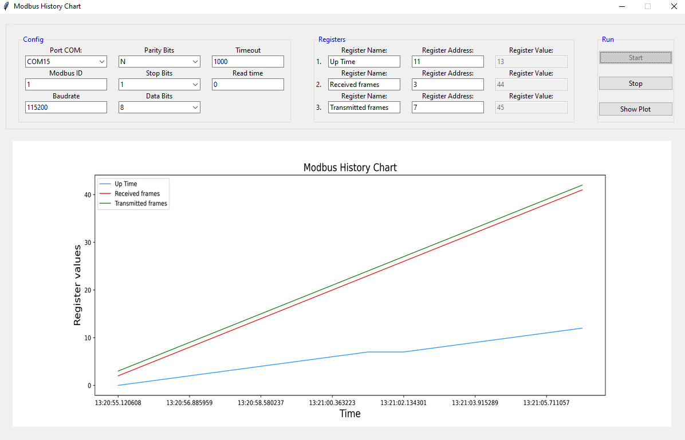
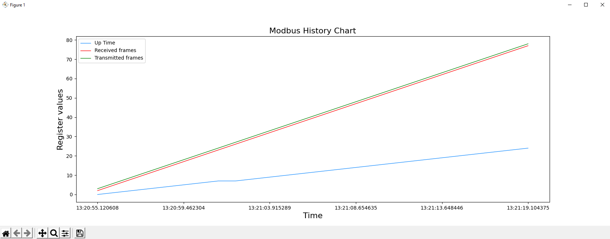

# Modbus History Chart

STILL WORK IN PROGRESS

Application aimed at creating a graph on the basis of values read from device registers via modbus. 
A tool built quickly for the job.

## How to use:
1. Run Modbus-history-chart.exe file in dist directory (no python required) or run main.py file in GUI directory
2. Set communication configuration in Config frame
3. Set registers names and addresses in Registers frame
4. Click Start button 

It is possible to pause the communication with the Stop button and start a new plot by clicking the Start button again.
While drawing the chart, you can press the Show Plot button to open the chart in a new window that allows you to zoom
in and select parts of the chart.

The chart is stored in the APPDATA folder and deleted when the application is closed.

## To Do:
- app is freezing during clicking STOP button (in try clause)
- show plot should be in different thread
- it is not possible to reconnect the device
- no protection against the lack of connection
- add Modbus TCP
